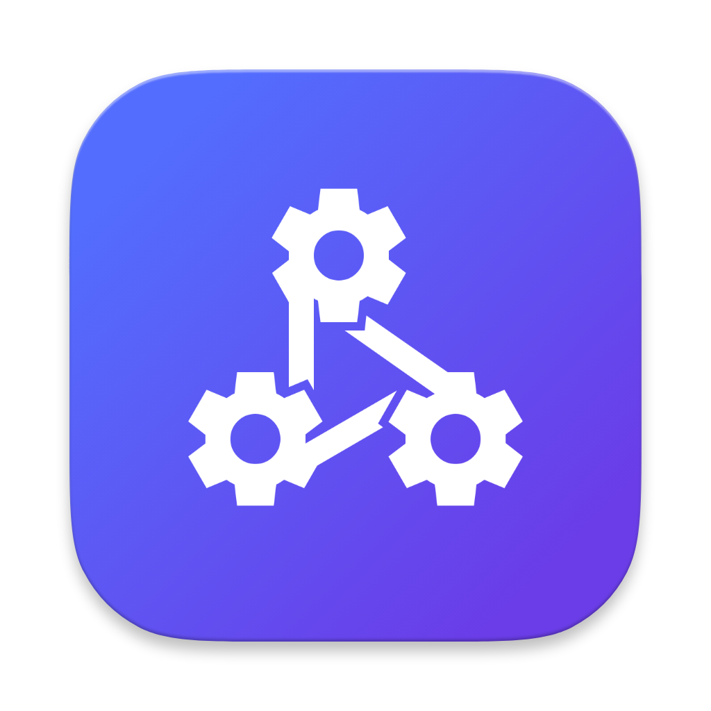

<div align="center">



# Wyre — Android

**Peer-to-peer file transfer for Android**

[](https://capacitorjs.com/)
[](https://kotlinlang.org/)
[](https://www.typescriptlang.org/)
[](#)
[](../LICENSE)
[](#)

Same protocol as the desktop app. Same UI. Fully cross-compatible.

</div>

---

## Overview

Wyre for Android is a [Capacitor 6](https://capacitorjs.com/) application that runs the same TypeScript/HTML/CSS UI as the desktop app inside a native WebView, backed by a Kotlin native layer that handles all networking, file I/O, and Android system integration.

The result is a native Android app that is **100% protocol-compatible** with the desktop app — you can send files from Android to macOS, Windows to Android, or any combination.

---

## ✨ Features

| Feature | Details |
|---------|---------|
| **Automatic discovery** | UDP broadcast on port `49152` — same protocol as desktop |
| **File send** | Intent-based file picker (`ACTION_GET_CONTENT`) with multi-select |
| **Folder send** | `ACTION_OPEN_DOCUMENT_TREE` picker; folder is zipped via `DocumentFile` (scoped storage compatible) |
| **Accept / Decline** | 30-second countdown dialog on incoming transfers |
| **Real-time progress** | Live KB/s speed and ETA per transfer |
| **Transfer resume** | Paused transfers resume from the last byte |
| **SHA-256 verification** | Every received file is checksummed; corrupted files are rejected |
| **Transfer cancellation** | Cancel from sender or receiver side at any time |
| **Transfer history** | Full log of completed, failed, and cancelled transfers (500 entries) |
| **Clipboard sharing** | Send clipboard text directly to another device over TCP |
| **Built-in chat** | Real-time text and file messaging with any discovered device |
| **OS notifications** | Native Android notifications via `@capacitor/local-notifications` |
| **Background service** | Optional foreground service keeps discovery and transfers running when the app is backgrounded |
| **Auto-accept** | Whitelist trusted device IDs for hands-free transfers |
| **Dark / Light / System theme** | Shared with desktop — respects Android system theme |
| **Open / Show in folder** | Open received files with the system viewer or navigate to Downloads |

---

## 🏗 Architecture

```
AndroidApp/
├── src/                                  # TypeScript / WebView layer
│   ├── bridge/
│   │   ├── WyrePlugin.ts                 # Typed Capacitor plugin registration
│   │   └── AppBridge.ts                  # Replaces desktop IpcClient — same API surface
│   ├── renderer/                         # Shared WebView UI (identical to desktop)
│   │   ├── components/                   # DeviceCard, TransferItem, IncomingDialog…
│   │   ├── views/                        # HomeView, TransfersView, ChatView, SettingsView
│   │   ├── styles/                       # tokens + components (shared) + android.css
│   │   └── index.ts                      # Bootstrap — uses AppBridge instead of IpcClient
│   └── shared/                           # Models + utils (identical to desktop)
│
└── android/
    └── app/src/main/java/com/wyre/app/
        ├── MainActivity.kt               # Capacitor BridgeActivity entry point
        ├── WyrePlugin.kt                 # @CapacitorPlugin — exposes all methods to JS
        ├── WyrePluginBridge.kt           # Singleton bridge between plugin and service
        ├── WyreService.kt                # Android foreground service (background mode)
        ├── WyreManager.kt                # Central coordinator — owns all services
        ├── DiscoveryService.kt           # UDP broadcast + listen (port 49152)
        ├── TransferServer.kt             # TCP server — accepts incoming connections
        ├── TransferClient.kt             # TCP client — initiates outgoing transfers
        ├── TransferModels.kt             # Sealed event classes + data models
        ├── ChatManager.kt                # Chat session manager
        └── SettingsStore.kt              # SharedPreferences wrapper
```

### Layer Diagram

```
TypeScript (WebView)
    │  Capacitor.Plugins.WyrePlugin.method(args)
    ▼
WyrePlugin.kt  (@CapacitorPlugin)
    │  delegates to
    ▼
WyreManager.kt  (coordinator)
    ├── DiscoveryService.kt  (UDP)
    ├── TransferServer.kt    (TCP incoming)
    ├── TransferClient.kt    (TCP outgoing)
    ├── ChatManager.kt       (chat sessions)
    └── SettingsStore.kt     (SharedPreferences)
```

---

## 🔄 Desktop vs Android Comparison

| Concern | Desktop | Android |
|---------|---------|---------|
| Shell | Electron `BrowserWindow` | Capacitor `WebView` |
| IPC | `window.api` (contextBridge) | `AppBridge` → Capacitor plugin |
| UDP/TCP | Node.js `dgram` / `net` | Kotlin `DatagramSocket` / `Socket` |
| File I/O | Node.js `fs` | Android `InputStream` / `OutputStream` |
| File picker | Drag-and-drop + `<input>` | `Intent.ACTION_GET_CONTENT` |
| Folder picker | Native dialog | `Intent.ACTION_OPEN_DOCUMENT_TREE` |
| Folder zip | Node.js `archiver` | `DocumentFile` + `ZipOutputStream` |
| Settings | `electron-store` | `SharedPreferences` |
| Notifications | `electron` native | `@capacitor/local-notifications` |
| Background | N/A | Android foreground service |
| Encryption | `node:crypto` (ECDH + AES-GCM) | `javax.crypto` (ECDH + AES-GCM) |

---

## 🌐 Network Protocol

The Android app implements the **exact same protocol** as the desktop app.

### Discovery — UDP port 49152

Every device broadcasts a JSON announcement every **3 seconds** using `DatagramSocket` with directed broadcast (computed from the active network interface's subnet mask):

```json
{
  "id": "uuid-v4",
  "name": "Pixel 8",
  "platform": "android",
  "port": 49200,
  "version": "1.0.0",
  "encryptionSupported": true
}
```

- Devices not seen for **10 s** → marked offline
- Devices offline for **60 s** → removed from registry

### Transfer — TCP (dynamic port, default 49200)

Identical wire format to the desktop app. The `TransferServer` listens on a TCP port and routes incoming connections by the `type` field in the JSON header:

| `type` field | Routed to |
|---|---|
| *(absent / file)* | File transfer handler |
| `"clipboard"` | `onClipboardReceived` callback |
| `"chat_handshake"` | `ChatManager.handleIncomingConnection()` |

### Scoped Storage (Android 10+)

Folder sends use `DocumentFile` to traverse `content://` URIs from `ACTION_OPEN_DOCUMENT_TREE`, which is the only way to read directories on Android 10+ with scoped storage. Each file is read via `ContentResolver.openInputStream()` and streamed into a `ZipOutputStream` in the app's cache directory before sending.

---

## 📡 Capacitor Plugin API

`WyrePlugin` exposes the following methods to the TypeScript layer. All methods are called via `Capacitor.Plugins.WyrePlugin`.

### Settings

| Method | Payload | Returns | Description |
|--------|---------|---------|-------------|
| `getSettings` | — | `AppSettings` | Get all current settings |
| `setSettings` | `Partial<AppSettings>` | — | Update one or more settings |

### Discovery

| Method | Payload | Returns | Description |
|--------|---------|---------|-------------|
| `getDevices` | — | `{ devices: Device[] }` | Get currently online devices |
| `startDiscovery` | — | — | Start UDP broadcast + listen |
| `stopDiscovery` | — | — | Stop UDP broadcast + listen |

### File Transfer

| Method | Payload | Returns | Description |
|--------|---------|---------|-------------|
| `sendFile` | `{ deviceId, filePath, fileName, fileSize }` | `{ transferId }` | Send a single file |
| `sendFolder` | `{ deviceId, folderUri, folderName }` | `{ transferId }` | Zip and send a folder |
| `cancelTransfer` | `{ transferId }` | — | Cancel an active transfer |
| `resumeTransfer` | `{ transferId }` | — | Resume a paused transfer |
| `respondToIncoming` | `{ transferId, accepted, savePath? }` | — | Accept or decline an incoming request |

### File Picker

| Method | Payload | Returns | Description |
|--------|---------|---------|-------------|
| `pickFile` | — | `{ files: FileInfo[] }` | Open system file picker (multi-select) |
| `pickFolder` | — | `{ path, uri }` | Open system folder picker |

### Clipboard

| Method | Payload | Returns | Description |
|--------|---------|---------|-------------|
| `sendClipboard` | `{ deviceId, text }` | — | Send clipboard text to a device |

### Chat

| Method | Payload | Returns | Description |
|--------|---------|---------|-------------|
| `chatOpenSession` | `{ deviceId }` | `{ sessionId }` | Open a chat session with a device |
| `chatCloseSession` | `{ sessionId }` | — | Close a chat session |
| `chatSendText` | `{ sessionId, text }` | `ChatMessage` | Send a text message |
| `chatSendFile` | `{ sessionId, fileName, fileSize, base64 }` | `ChatMessage` | Send a file in chat |
| `chatEditMessage` | `{ sessionId, messageId, newText }` | — | Edit a sent message |
| `chatDeleteMessage` | `{ sessionId, messageId }` | — | Delete a sent message |
| `chatAcceptInvite` | `{ sessionId }` | — | Accept an incoming chat invite |
| `chatDeclineInvite` | `{ sessionId }` | — | Decline an incoming chat invite |
| `chatGetSessions` | — | `{ sessions }` | Get all chat sessions |
| `chatMarkRead` | `{ sessionId }` | — | Mark a session as read |
| `chatSaveFile` | `{ fileName, base64 }` | `{ path }` | Save a chat file to Downloads |

### History

| Method | Payload | Returns | Description |
|--------|---------|---------|-------------|
| `getHistory` | — | `{ history: TransferRecord[] }` | Get transfer history |
| `clearHistory` | — | — | Clear transfer history |

### Shell

| Method | Payload | Returns | Description |
|--------|---------|---------|-------------|
| `openFile` | `{ path }` | — | Open a file with the system viewer |
| `showInFolder` | `{ path }` | — | Open the Downloads folder |

### Events (pushed from native → JS)

| Event | Payload | Description |
|-------|---------|-------------|
| `devicesUpdated` | `{ devices: Device[] }` | Device list changed |
| `incomingRequest` | `IncomingRequestPayload` | Incoming file transfer request |
| `transferStarted` | `TransferStartedPayload` | Transfer registered |
| `transferProgress` | `TransferProgressPayload` | Progress update (every 100 ms) |
| `transferComplete` | `TransferCompletePayload` | Transfer finished successfully |
| `transferError` | `TransferErrorPayload` | Transfer failed or cancelled |
| `clipboardReceived` | `{ senderName, text, truncated }` | Clipboard text received |
| `chatInvite` | `ChatInvitePayload` | Incoming chat invite |
| `chatMessage` | `ChatMessagePayload` | New chat message received |

---

## ⚙️ Settings

All settings are persisted via `SharedPreferences`.

| Setting | Type | Default | Description |
|---------|------|---------|-------------|
| `deviceId` | `string` | auto (UUID v4) | Unique device identifier |
| `deviceName` | `string` | `Build.MODEL` | Display name shown to peers |
| `transferPort` | `number` | `49200` | TCP port for incoming transfers |
| `saveDirectory` | `string` | `Downloads/` | Default save location |
| `theme` | `'dark' \| 'light' \| 'system'` | `'system'` | UI theme |
| `autoAccept` | `boolean` | `false` | Auto-accept from trusted devices |
| `trustedDeviceIds` | `string[]` | `[]` | Device IDs to auto-accept from |
| `autoDeclineTimeout` | `number` | `30` | Seconds before auto-declining |
| `showNotifications` | `boolean` | `true` | Android notifications |
| `backgroundService` | `boolean` | `false` | Keep running in background |
| `uiScale` | `number` | `1.0` | UI zoom factor |

---

## 🚀 Getting Started

### Prerequisites

- [Node.js](https://nodejs.org/) 20+
- [Android Studio](https://developer.android.com/studio) (Hedgehog or newer)
- Android SDK 34
- Java 17 (bundled with Android Studio)

### Install

```bash
cd AndroidApp
npm install
```

### Build the Web Layer

```bash
npm run build
```

Compiles TypeScript and bundles with Vite into `dist/`.

### Sync to Android

```bash
npm run sync
```

Runs `npm run build` then `npx cap sync android` — copies the web bundle and Capacitor config into the Android project.

### Open in Android Studio

```bash
npm run open
```

Opens the `android/` project in Android Studio. From there you can run on a device or emulator, or build a release APK.

### Type Check

```bash
npm run typecheck
```

### Lint

```bash
npm run lint
```

---

## 🔐 Release Build

The release build is signed using environment variables. Set these before running `./gradlew assembleRelease`:

```bash
export KEYSTORE_PATH=/path/to/keystore.jks
export KEYSTORE_PASS=your_store_password
export KEY_ALIAS=wyre
export KEY_PASS=your_key_password
```

```bash
cd android
./gradlew assembleRelease
```

The signed APK will be at `android/app/build/outputs/apk/release/app-release.apk`.

---

## 📦 Dependencies

### JavaScript / TypeScript

| Package | Version | Purpose |
|---------|---------|---------|
| `@capacitor/core` | `^6.0.0` | Capacitor runtime |
| `@capacitor/android` | `^6.0.0` | Android platform |
| `@capacitor/local-notifications` | `^6.0.0` | Native notifications |
| `@capacitor/filesystem` | `^6.0.0` | File system access |
| `@capacitor/preferences` | `^6.0.0` | Key-value storage |
| `@fortawesome/fontawesome-free` | `6.5.0` | UI icons |

### Android (Gradle)

| Dependency | Version | Purpose |
|------------|---------|---------|
| `com.capacitorjs:core` | `6.1.0` | Capacitor Android runtime |
| `androidx.appcompat:appcompat` | `1.6.1` | AppCompat |
| `androidx.core:core-ktx` | `1.12.0` | Kotlin extensions |
| `androidx.webkit:webkit` | `1.9.0` | WebView |
| `androidx.activity:activity-ktx` | `1.8.2` | ActivityResult API |
| `androidx.documentfile:documentfile` | `1.0.1` | Scoped storage / `content://` URIs |

---

## 🔒 Permissions

The app requests the following Android permissions:

| Permission | Reason |
|------------|--------|
| `INTERNET` | TCP/UDP networking |
| `ACCESS_NETWORK_STATE` | Detect active network interface for directed broadcast |
| `ACCESS_WIFI_STATE` | Same |
| `CHANGE_WIFI_MULTICAST_STATE` | UDP multicast/broadcast |
| `READ_EXTERNAL_STORAGE` | Read files to send (API < 33) |
| `WRITE_EXTERNAL_STORAGE` | Save received files (API < 29) |
| `READ_MEDIA_IMAGES` / `READ_MEDIA_VIDEO` / `READ_MEDIA_AUDIO` | Granular media access (API 33+) |
| `POST_NOTIFICATIONS` | Transfer notifications (API 33+) |
| `FOREGROUND_SERVICE` | Background service |
| `FOREGROUND_SERVICE_DATA_SYNC` | Background service type (API 34+) |

---

## 🎨 UI

The Android app uses the same TypeScript/HTML/CSS UI as the desktop app, with one addition: `android.css` overrides layout and interaction patterns for mobile:

- Bottom navigation bar instead of sidebar
- Touch-optimised tap targets
- Full-screen views
- Android-style back navigation

---

<div align="center">

Part of the [Wyre](../README.md) project · MIT License · Built by [MBVRK](https://github.com/MbarkT3STO)

</div>
